# Portfolio Management module

Portfolio module of a personal investments and trading app: one portfolio per account, holding
stocks (ticker, quantity, average purchase price) and a target allocation, with a rebalance
operation that says what to buy and sell. Ships with an interactive CLI.

## Quick start

```
make build      # compile + package target/portfolio-cli.jar (tests skipped)
make run        # interactive CLI
make test       # JUnit 5 + Mockito unit tests
make coverage   # tests + JaCoCo; fails if Portfolio coverage < 80%  (target/site/jacoco/index.html)
make clean
```

Requires Maven and a JDK 17+. On macOS the Makefile picks a JDK 17 automatically when one is installed.
Logs (SLF4J + Logback) are written to `logs/portfolio.log`, not to the console, so they don't mix with the CLI output.

## CLI

```
create <account>                      create the account's portfolio (one per account)
add <account> <ticker> <qty> <price>  buy shares; repeated buys update the average price
sell <account> <ticker> <qty>         sell shares
target <account> <TICKER=PCT> ...     e.g. target acc1 META=40 AAPL=60   (must add up to 100)
show <account>                        holdings and target
allocation <account>                  current vs. target allocation
rebalance <account> [apply]           show the buys/sells needed; 'apply' also executes them
help | exit
```

The mock market data knows AAPL, AMZN, GOOGL, META, MSFT, NVDA and TSLA.
Storage is in memory, so data is lost when the CLI exits.

## Design

Full diagrams (layers, domain model, rebalance flow, algorithm, error handling) are in
[`docs/ARCHITECTURE.md`](docs/ARCHITECTURE.md); SVG copies are in [`docs/diagrams/`](docs/diagrams).




```
org.example.portfolio
├── api       PortfolioService            contract consumed by the main application
├── spi       PortfolioRepository,        contracts implemented by other modules (persistence, accounts)
│             AccountDirectory
├── domain    Portfolio (aggregate), Stock, TargetAllocation, RebalancePlan, TradeAction, PortfolioSnapshot,
│             MarketDataProvider, RebalanceStrategy   (ports the domain depends on)
├── service   DefaultPortfolioService, ProportionalRebalanceStrategy
├── infra     InMemoryPortfolioRepository, MockMarketDataProvider, MockAccountDirectory   (mocks of external services)
├── cli       PortfolioCli
└── exception PortfolioException and subclasses
org.example.Main                          composition root
```

- **SRP** – `Portfolio` guards its own invariants; use-case orchestration lives in the service, the buy/sell policy in a strategy, I/O in the CLI.
- **OCP** – new rebalancing policies implement `RebalanceStrategy`; `Portfolio` doesn't change.
- **LSP / ISP** – small, focused interfaces (`MarketDataProvider` has one method, `AccountDirectory` has one); every implementation, mocks included, honours the documented contract.
- **DIP** – `Portfolio`, the service and the CLI depend on interfaces only; `Main` is the only place that picks implementations.
- **Testability** – every collaborator is injected, so `Portfolio` is tested with Mockito mocks of `MarketDataProvider` and `RebalanceStrategy`. The CLI takes its input/output streams as constructor arguments.
- The service returns immutable `PortfolioSnapshot`s so callers can't mutate the aggregate behind its back.

### Rebalancing rules (`ProportionalRebalanceStrategy`)

- Self-financing: the portfolio's current market value is redistributed per the target percentages; no extra cash is assumed.
- Holdings not in the target are sold completely.
- Whole shares only: sells are rounded to the nearest share, buys are rounded down, and total buys are capped by the proceeds of the sells (largest gap first). Small residual drift is therefore expected.
- An empty portfolio yields an empty plan (nothing to distribute).
- `rebalance` only computes the plan; `rebalance <account> apply` (or `PortfolioService.rebalanceAndApply`) also updates the holdings.

## Tests and coverage

108 unit tests. `Portfolio` is at 100% line, branch and method coverage, and the build enforces a minimum of 80% (`make coverage`).

---

## Original requirements

`You’re building a portfolio management module, part of a personal investments and trading app

Entities and Services of this module will be consumed by the main application, but also they will provide context data to initialize it or perform operations for the moment mock those external consumer services.
- Provide a CLI interface to interact with the Portfolio module, allowing users to create a Portfolio, add Stocks, view the current allocation, and perform rebalancing operations.
- Every account can have just one Portfolio.
- Portfolio assets can be just Stocks.
- Every Portfolio should have a Set of Stocks (Ticker, Quantity, Average Purchase Price).
- Portfolio class has a collection of “allocated” Stocks that represents the distribution of the Stocks the Portfolio is aiming (i.e. 40% META, 60% APPL)
- Provide a portfolio rebalance method to know which Stocks should be sold and which ones should be bought to have a balanced Portfolio based on the portfolio’s allocation.
- log operations and errors using a logging framework (e.g., SLF4J).


Use SOLID principles to design the module and provide interfaces to contract the other modules. The Portfolio class should be designed to be easily testable and maintainable.

Unit Test

- Perform 80% code coverage for the Portfolio class and its methods.
- Use JUnit for testing and Mockito for mocking dependencies.

Shipment Instructions:
Generate a Makefile to compile and run the application, as well as to execute the unit tests. The Makefile should include targets for building the project, running the CLI interface, and executing the unit tests.`