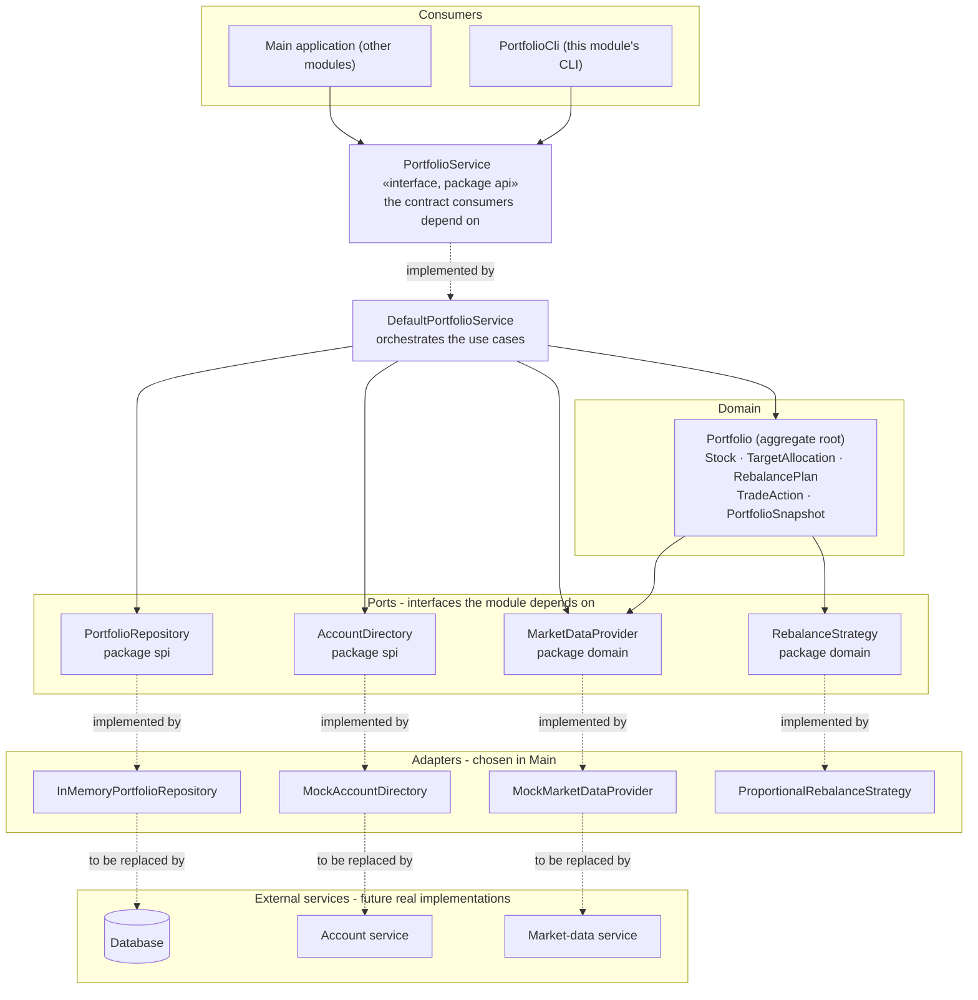
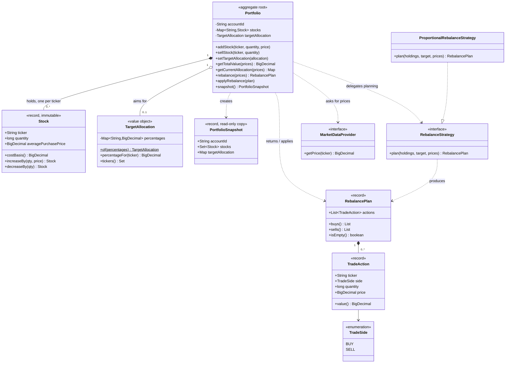
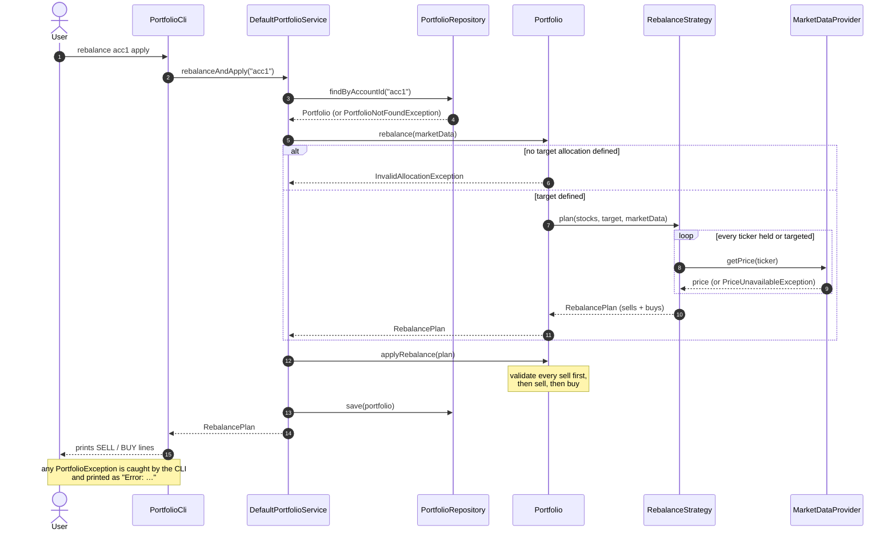
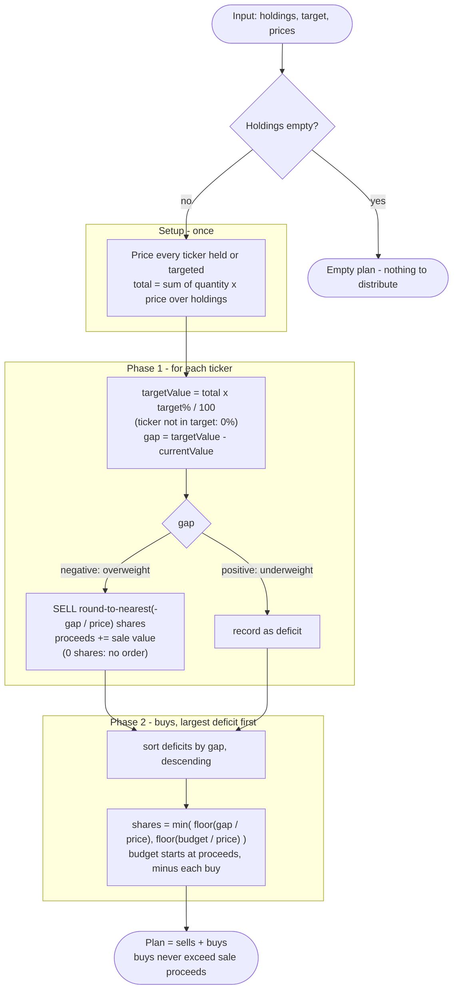
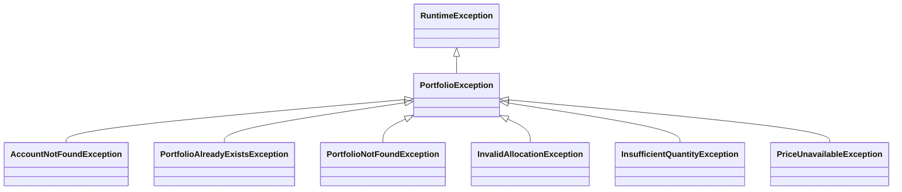

# Portfolio module – architecture

The diagrams below are Mermaid (rendered natively by GitHub, GitLab, IntelliJ and VS Code).
Pre-rendered SVG copies live in [`docs/diagrams/`](diagrams) for tools that don't render Mermaid.

| # | Diagram | Answers |
|---|---------|---------|
| 1 | [Layers and contracts](#1-layers-and-contracts) | Who talks to whom, which interfaces other modules consume or implement |
| 2 | [Domain model](#2-domain-model) | The entities, their relationships and the ports the domain depends on |
| 3 | [Rebalance flow](#3-rebalance-flow-rebalance-acc1-apply) | What happens at runtime for `rebalance <account> apply` |
| 4 | [Rebalance algorithm](#4-rebalance-algorithm-proportionalrebalancestrategy) | How the buy/sell list is computed |
| 5 | [Error handling](#5-error-handling) | Which failures exist and where they surface |

---

## 1. Layers and contracts

Dependencies point **inwards**: the CLI and the main application depend on the `api` contract; the service
depends on the domain and on `spi` interfaces; the domain depends only on its own ports.
Concrete adapters (the mocks, the in-memory repository, the rebalance policy) are chosen in one place, `Main`.

**Reading guide**

- **Consumers** only ever see `PortfolioService` and immutable `PortfolioSnapshot`s – never the mutable `Portfolio`.
- **`spi`** interfaces are what other modules implement to plug real persistence / accounts in. `MarketDataProvider` is the same kind of port but lives in `domain` because `Portfolio` itself needs prices.
- **`RebalanceStrategy`** is the open/closed extension point: add a new policy by implementing it, `Portfolio` does not change.

---

## 2. Domain model

**Invariants enforced by the domain**

| Rule | Where |
|------|-------|
| Ticker is trimmed, upper-cased and matches `[A-Z][A-Z0-9.-]{0,9}` | `Stock.normalizeTicker` |
| Quantity is a positive whole number; price is positive | `Stock`, `TradeAction` |
| At most one position per ticker (re-buying merges, average price is the weighted average) | `Portfolio.addStock` |
| A position that is fully sold disappears; you cannot sell more than you hold | `Portfolio.sellStock` |
| Target percentages are in (0, 100], tickers are unique and the sum is **exactly 100** | `TargetAllocation.of` |
| Rebalancing needs a target; `rebalance()` never mutates, `applyRebalance()` validates all sells before changing anything | `Portfolio` |
| **One portfolio per account** | `DefaultPortfolioService.createPortfolio` |

---

## 3. Rebalance flow (`rebalance acc1 apply`)

`rebalance <account>` (without `apply`) calls `PortfolioService.rebalance` instead: it stops after step 11, returns the plan and leaves the portfolio untouched (nothing is applied or saved).

---

## 4. Rebalance algorithm (`ProportionalRebalanceStrategy`)

The plan is **self-financing** (no extra cash assumed) and in **whole shares**, so a small residual drift from the exact target is expected.

---

## 5. Error handling

All business-rule violations extend `PortfolioException` (unchecked).

| Exception | Raised by | When |
|-----------|-----------|------|
| `AccountNotFoundException` | `DefaultPortfolioService` | `createPortfolio` for an account the `AccountDirectory` does not know |
| `PortfolioAlreadyExistsException` | `DefaultPortfolioService` | `createPortfolio` for an account that already has one |
| `PortfolioNotFoundException` | `DefaultPortfolioService` | any operation on an account without a portfolio |
| `InvalidAllocationException` | `TargetAllocation`, `Portfolio` | percentages malformed or not summing to 100; `rebalance` without a target |
| `InsufficientQuantityException` | `Portfolio` | selling more shares than held (also when applying a plan) |
| `PriceUnavailableException` | `MarketDataProvider` implementations | no price for a ticker needed for valuation or rebalancing |

**Propagation:** the domain throws, `DefaultPortfolioService` logs the failure once at ERROR and rethrows, and the caller decides what to do:
`PortfolioCli` logs a WARN and prints `Error: …`; the main application can handle them as it sees fit.
Malformed input (bad ticker, non-positive quantity or price) is an `IllegalArgumentException`, handled the same way by the CLI.

Logging (SLF4J + Logback → `logs/portfolio.log`): `Portfolio` logs state changes at INFO, the service logs creation and failed operations,
and the CLI logs every command plus recoverable failures (WARN) and unexpected ones (ERROR with stack trace).
