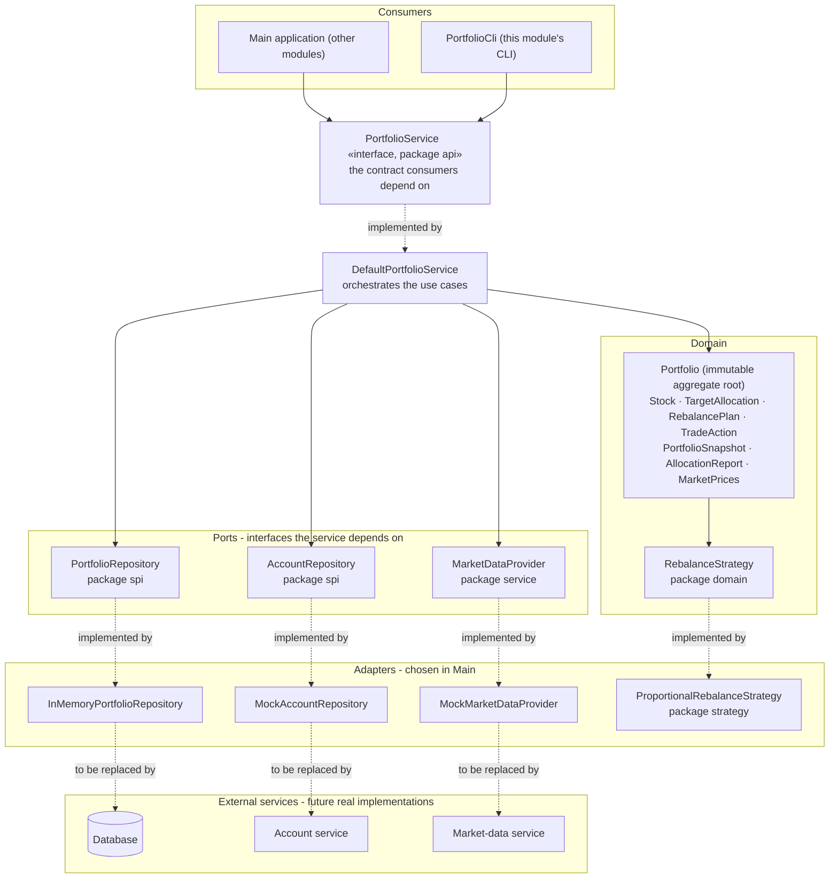
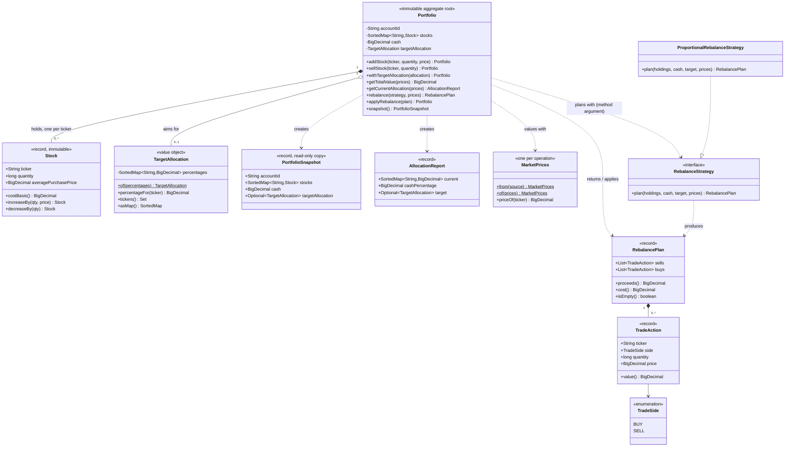
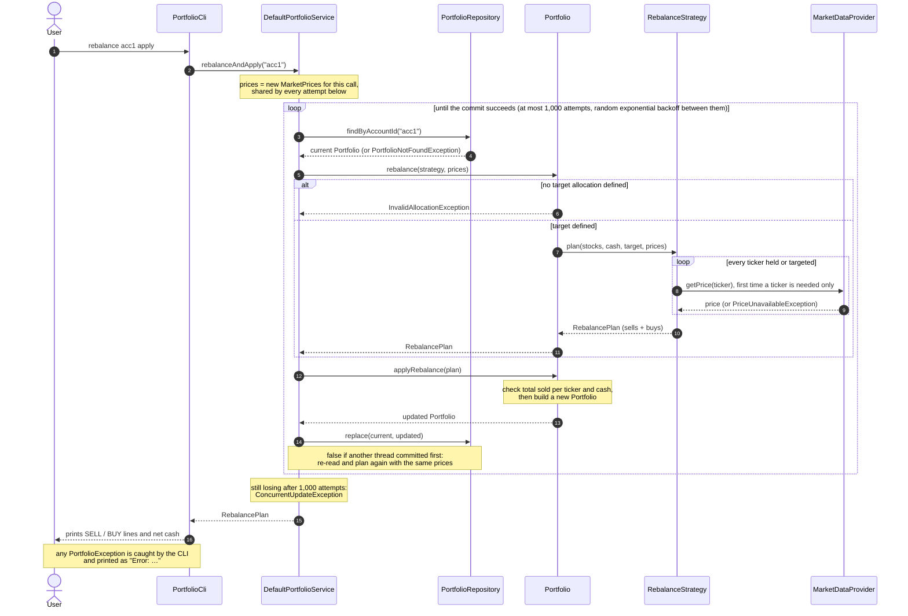
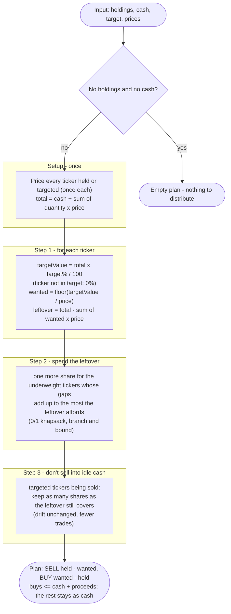
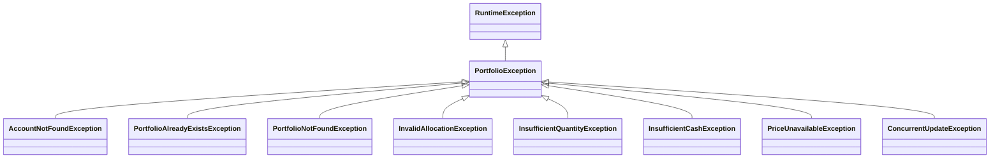

# Portfolio module – architecture

The diagrams below are Mermaid (rendered natively by GitHub, GitLab, IntelliJ and VS Code).
Pre-rendered SVG copies live in [`docs/diagrams/`](diagrams) for tools that don't render Mermaid.

| # | Diagram | Answers |
|---|---------|---------|
| 1 | [Layers and contracts](#1-layers-and-contracts) | Who talks to whom, which interfaces other modules consume or implement |
| 2 | [Domain model](#2-domain-model) | The entities, their relationships and the ports the domain depends on |
| 3 | [Rebalance flow](#3-rebalance-flow-rebalance-acc1-apply) | What happens at runtime for `rebalance <account> apply`, including concurrent updates |
| 4 | [Rebalance algorithm](#4-rebalance-algorithm-proportionalrebalancestrategy) | How the buy/sell list is computed |
| 5 | [Error handling](#5-error-handling) | Which failures exist and where they surface |

---

## 1. Layers and contracts

Dependencies point **inwards**: the CLI and the main application depend on the `api` contract; the service
depends on the domain, on the `spi` interfaces and on its own `MarketDataProvider` contract; the domain depends
on nothing outside itself. Concrete adapters (the mocks, the in-memory repository, the rebalance policy) are
chosen in one place, `Main`.

**Reading guide**

- **Consumers** only ever see `PortfolioService` and immutable `PortfolioSnapshot`s / `AllocationReport`s.
- **`spi`** interfaces are what other modules implement to plug real persistence / accounts in.
  `MarketDataProvider` is the contract with the market-data service; it lives in `service`, its only user.
  The domain never calls it: the service wraps it in a `MarketPrices` (each ticker read once per operation)
  and passes that to `Portfolio`.
- **`RebalanceStrategy`** is the open/closed extension point: add a new policy by implementing it (in `strategy`)
  and passing it to `Portfolio.rebalance`; `Portfolio` does not change.

---

## 2. Domain model

**Invariants enforced by the domain**

| Rule | Where |
|------|-------|
| Ticker is trimmed, upper-cased and matches `[A-Z][A-Z0-9.-]{0,9}` | `Stock.normalizeTicker` |
| Quantity is a positive whole number; price is positive (a null trade price is an `IllegalArgumentException` too) | `Stock`, `TradeAction`, `MarketPrices` |
| At most one position per ticker (re-buying merges, average price is the weighted average) | `Portfolio.addStock` |
| A position that is fully sold disappears; you cannot sell more than you hold | `Portfolio.sellStock` |
| Target percentages are in (0, 100], tickers are unique and the sum is **exactly 100**; stored without trailing zeros | `TargetAllocation.of` |
| Cash is never negative; only rebalancing changes it | `Portfolio.applyRebalance` |
| Rebalancing needs a target; `rebalance()` never changes anything; `applyRebalance()` checks the total sold per ticker against the holdings and the buys against cash + proceeds before changing anything, and is all-or-nothing | `Portfolio` |
| A plan contains only sells in `sells` and only buys in `buys` | `RebalancePlan` |
| **One portfolio per account** | `PortfolioRepository.saveIfAbsent` (atomic) |

**Design notes**

- `PortfolioSnapshot`, `AllocationReport` and `RebalancePlan` copy their collections on construction, whoever builds
  them. A returned snapshot or plan is a faithful record of the state it came from (audit, data integrity), which is
  worth the O(n) copy.
- `Portfolio` keeps identity equality on purpose: the in-memory compare-and-set compares instances, so an `equals`
  by account id would make every `replace` succeed and bring lost updates back. A database repository would compare
  a version instead.
- `applyRebalance` takes the plan's prices as given. Plans should come from the same portfolio at current prices, as
  `PortfolioService.rebalanceAndApply` guarantees; a hand-made plan selling at an invented price would credit
  invented cash.

---

## 3. Rebalance flow (`rebalance acc1 apply`)

`rebalance <account>` (without `apply`) calls `PortfolioService.rebalance` instead: it reads the portfolio once,
returns the plan and commits nothing.

**Concurrency.** `Portfolio` is immutable, so a reader always sees one complete state, and a change can be
retried freely because building the new state has no side effects. `replace` is a compare-and-set (in memory, a
single `ConcurrentHashMap.replace(key, expected, updated)` call), so of two concurrent changes to one account
exactly one commits and the other is re-run on top of it: nothing is lost, and a plan is always applied to the
state it was computed from. No lock is held while prices are fetched, and prices are fetched once per call, not per
attempt, so a retry is pure computation: a slow market feed cannot make a rebalance lose every race against faster
writers. After each lost race the thread waits a random pause below a ceiling that doubles every time (64 ns up to
1 ms, "full jitter"), so writers racing for one account spread out instead of colliding again; an update still losing
after 1,000 attempts gives up with `ConcurrentUpdateException`, which is safe to retry.

---

## 4. Rebalance algorithm (`ProportionalRebalanceStrategy`)

**Drift** is the total distance from the target: |value − target value| summed over every ticker and the cash
(whose target is zero). One more share of a ticker that is short of its target by `gap` (less than a share) lowers
the drift by 2 × gap and costs one share price, so step 2 is a 0/1 knapsack: the affordable set of extra shares with
the largest total gap. Taking the largest gap first is not enough, because one expensive share can block two cheaper
ones that close more (5 AAPL for META 33 / MSFT 33 / NVDA 34 ends 94.7% NVDA that way, instead of one META plus one
MSFT). Branch and bound over the tickers, sorted by gap per price and pruned with the fractional knapsack bound,
finds the best set exactly for typical portfolios of a few dozen stocks. Its search is capped at 10,000 steps, which
many tickers at very mixed prices can exceed; the plan then uses the best set found so far, never worse than taking
shares by gap per price. Beyond 1,000 underweight tickers the search is skipped altogether (a portfolio that large is
better served by an index fund). Step 3 does not change the drift, since unsold shares and idle
cash count the same, but saves trades. That is also why a ticker can stay more than one share over its target: when
no underweight ticker is affordable, selling it would only move money into cash.

All arithmetic is exact (`BigDecimal`), so the value of the holdings plus the cash is the same before and after a
plan is applied, and planning again at the same prices gives an empty plan. Among plans that keep at least the
whole shares fitting each target, the plan leaves the least drift whenever the search completes.

**Known limitation.** Giving up a share that fits one ticker's target, to fund a share of another, is not considered,
and can leave less drift: 2 META sold toward NVDA 80% / AMZN 20% at 900 / 180 keeps 2 AMZN and 64% cash, where giving
up the one AMZN share that fits would fund an NVDA and leave 10% cash. A wider search (allowing fewer shares than fit)
is a planned follow-up. Cost is O(n log n) for n tickers plus the bounded search, with one price lookup per ticker.

---

## 5. Error handling

All business-rule violations extend `PortfolioException` (unchecked).

| Exception | Raised by | When |
|-----------|-----------|------|
| `AccountNotFoundException` | `DefaultPortfolioService` | `createPortfolio` for an account the `AccountRepository` does not know |
| `PortfolioAlreadyExistsException` | `DefaultPortfolioService` | `createPortfolio` for an account that already has one |
| `PortfolioNotFoundException` | `DefaultPortfolioService` | any operation on an account without a portfolio |
| `InvalidAllocationException` | `TargetAllocation`, `Portfolio` | percentages malformed or not summing to 100; `rebalance` without a target |
| `InsufficientQuantityException` | `Portfolio` | selling more shares than held, including a plan whose sells of one ticker add up to more than is held |
| `InsufficientCashException` | `Portfolio` | applying a plan whose buys cost more than the cash plus its sale proceeds |
| `PriceUnavailableException` | `MarketDataProvider` implementations, `MarketPrices` | no price for a ticker needed for valuation or rebalancing |
| `ConcurrentUpdateException` | `DefaultPortfolioService` | an update lost the compare-and-set race 1,000 times in a row; safe to retry |

**Propagation:** the domain throws, `DefaultPortfolioService` logs the failure **once** and rethrows, and the caller
decides what to do: `PortfolioCli` prints `Error: …` without logging again; the main application can handle them
as it sees fit. Malformed input (bad ticker, non-positive quantity or price) is an `IllegalArgumentException`,
handled the same way by the CLI.

Logging (SLF4J + Logback → `logs/portfolio.log`): the service logs every committed change at INFO, rejected
business rules at WARN, malformed input at INFO and unexpected failures at ERROR with their stack trace. `Portfolio`
does not log: it is an immutable value whose methods may run more than once when a concurrent update forces a
retry. The CLI logs every command it receives.
